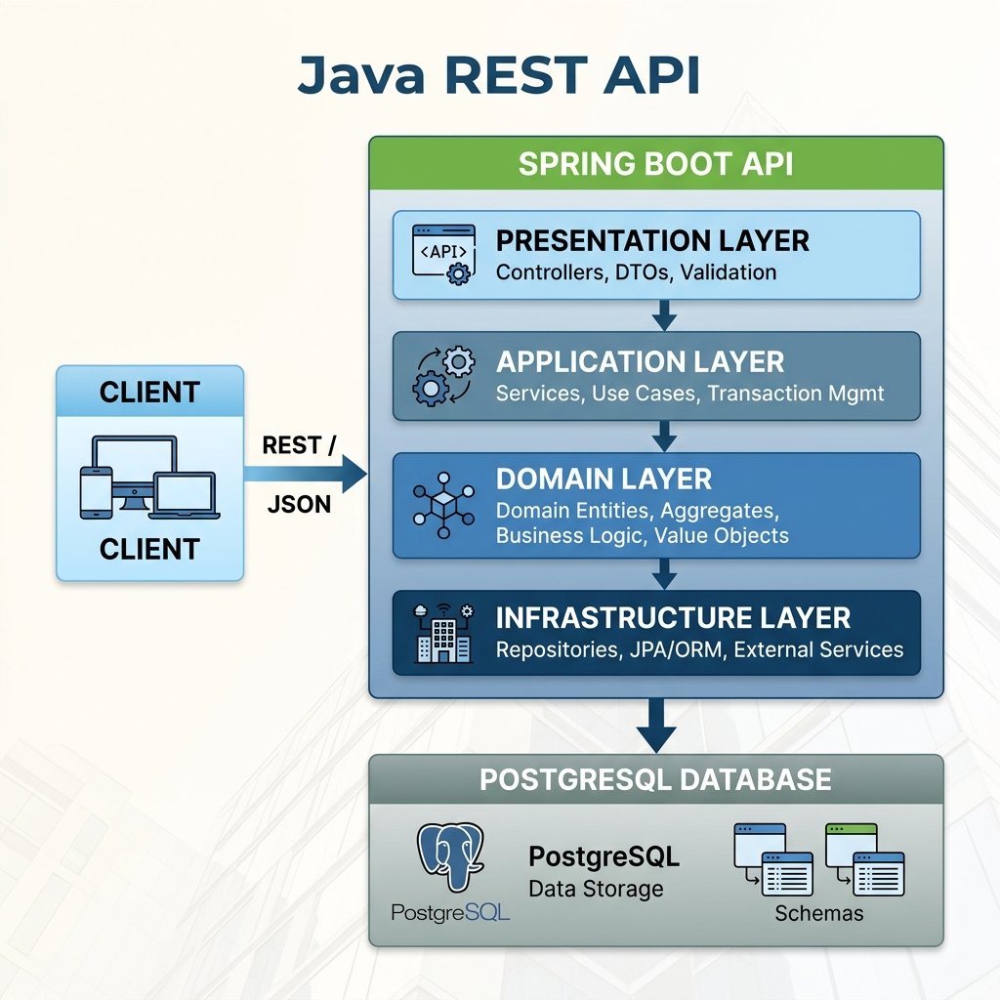
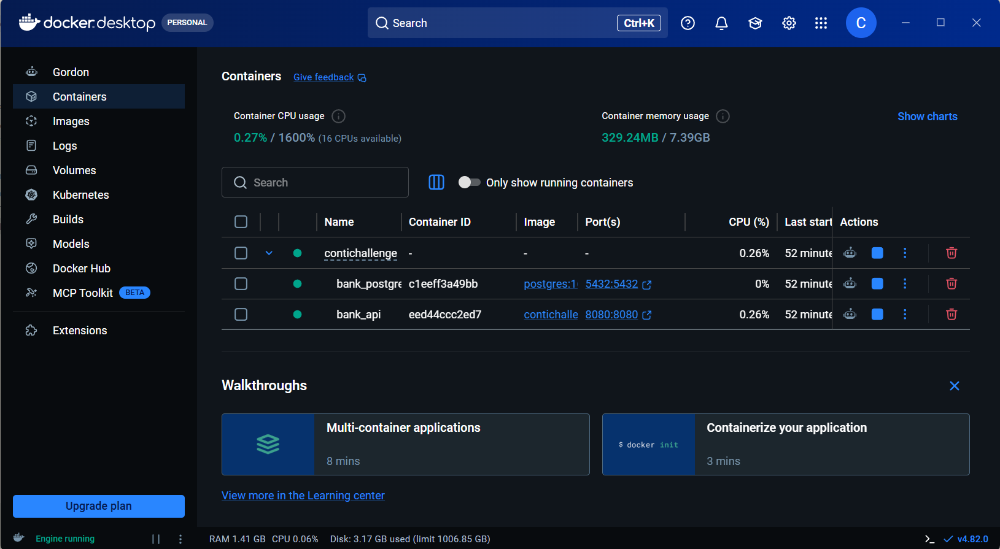
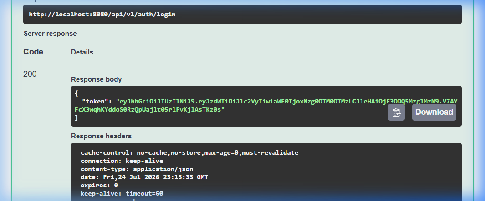
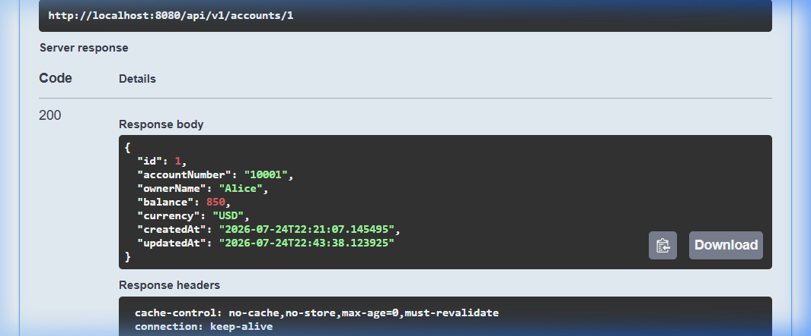
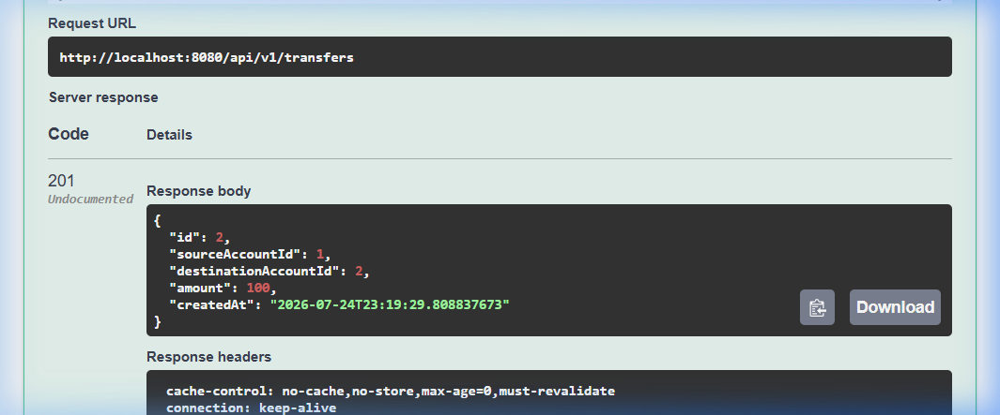

# ContiChange Bank Transfer API

[](https://github.com/carlobeni/ContiChallenge/actions/workflows/build.yml)


Esta es una API REST desarrollada para la gestión de transferencias bancarias entre cuentas. El sistema está diseñado siguiendo los principios de **Clean Architecture** y **Domain-Driven Design (DDD)** para una escalabilidad e independencia de frameworks.

### Entregables Incluidos
- Repositorio con el código fuente.
- Instrucciones detalladas de ejecución.
- Colección de Postman (`Bank API.postman_collection.json`) ubicada en la raíz del proyecto para pruebas rápidas.
- Diagrama de arquitectura de la solución.

## Stack Técnico

- **Java 21**
- **Spring Boot 3.x**
- **PostgreSQL**
- **Spring Data JPA / Hibernate**
- **Flyway** para migraciones de base de datos
- **MapStruct** para el mapeo de DTOs
- **JWT (JSON Web Tokens)** para autenticación *stateless*
- **JUnit 5, Mockito & Testcontainers** para *Unit Tests* e *Integration Tests*
- **Docker & Docker Compose** para contenedores
- **Springdoc OpenAPI** para documentación de API interactiva

## Arquitectura

El sistema implementa **Clean Architecture**, asegurando que las reglas core de negocio sean independientes de la interfaz de usuario, bases de datos o dependencias externas. El diseño de interfaces, capas y responsabilidades se encuentra estrictamente delimitado, promoviendo código autodescriptivo y altamente mantenible.



### Capas del Sistema (Layers)

| Capa (Layer) | Responsabilidad | Descripción |
|---|---|---|
| **Domain** | Lógica de Negocio | Contiene la lógica de negocio pura, entidades (`Account`, `Transfer`), excepciones de negocio e interfaces de repositorios. Totalmente desacoplado de frameworks como Spring o JPA. |
| **Application** | *Use Cases* | Orquesta los casos de uso (*Use Cases* / *Services*), gestionando el flujo de datos entre el *Domain* y la capa de *Presentation* mediante DTOs y Mappers (MapStruct). |
| **Infrastructure**| Adaptadores | Implementa los adaptadores de persistencia utilizando Spring Data JPA, configuraciones de base de datos y configuraciones de seguridad (JWT). |
| **Presentation** | Endpoints | Controladores REST que exponen los endpoints HTTP y un manejador global de excepciones para el control centralizado de errores. |

## Reglas de Negocio y Consideraciones Técnicas

La API cumple estrictamente con los siguientes requerimientos funcionales y técnicos:
- **Transferencias:** Ejecución de transferencias con validaciones de existencia, previniendo transferencias hacia la misma cuenta y garantizando que el monto sea mayor a cero.
- **Saldos:** Confirma que la cuenta de origen disponga de saldo suficiente previo a la transacción.
- **Consultas:** Permite la consulta de información de la cuenta y el historial completo de transferencias realizadas y recibidas.
- **Transaccionalidad y Concurrencia:** Implementa *Pessimistic Locking* de base de datos y transacciones seguras para evitar *deadlocks* e inconsistencia de datos.
- **Estándares REST:** Uso adecuado de verbos HTTP (GET, POST) y códigos de estado HTTP semánticos (200 OK, 201 Created, 404 Not Found, 409 Conflict).
- **Manejo de Errores y Logs:** Manejo centralizado de excepciones y logs descriptivos en la consola, correctamente categorizados por nivel y origen.

## Base de Datos y Validaciones

Las validaciones del sistema se realizan en **dos niveles** para garantizar la integridad y consistencia de los datos:

1. **A nivel de Aplicación (Java):** Usando *Bean Validation* (`@NotNull`, `@Positive`, etc.) en los DTOs de la capa de entrada (ej. `TransferRequestDto`) para interceptar peticiones malformadas de forma temprana.
2. **A nivel de Base de Datos (SQL):** Mediante restricciones como `CHECK` y `NOT NULL` en las tablas, asegurando una capa de protección adicional y de persistencia estricta.

A continuación se muestra el esquema SQL principal y las validaciones de base de datos (ubicado en `src/main/resources/db/migration/V1__create_tables.sql`):

```sql
CREATE TABLE accounts (
    id BIGSERIAL PRIMARY KEY,
    account_number VARCHAR(50) NOT NULL UNIQUE,
    owner_name VARCHAR(100) NOT NULL,
    balance DECIMAL(15, 2) NOT NULL CHECK (balance >= 0),
    currency VARCHAR(3) NOT NULL,
    created_at TIMESTAMP NOT NULL DEFAULT CURRENT_TIMESTAMP,
    updated_at TIMESTAMP NOT NULL DEFAULT CURRENT_TIMESTAMP
);

CREATE TABLE transfers (
    id BIGSERIAL PRIMARY KEY,
    source_account_id BIGINT NOT NULL,
    destination_account_id BIGINT NOT NULL,
    amount DECIMAL(15, 2) NOT NULL CHECK (amount > 0),
    created_at TIMESTAMP NOT NULL DEFAULT CURRENT_TIMESTAMP,
    CONSTRAINT fk_source_account FOREIGN KEY (source_account_id) REFERENCES accounts(id),
    CONSTRAINT fk_destination_account FOREIGN KEY (destination_account_id) REFERENCES accounts(id)
);

CREATE INDEX idx_transfers_source ON transfers(source_account_id);
CREATE INDEX idx_transfers_destination ON transfers(destination_account_id);
```

## Instalación

### Prerrequisitos
- **Docker** y **Docker Compose** instalados en el sistema.
- Los puertos `8080` (API) y `5432` (PostgreSQL) deben estar disponibles.

### Instrucciones de Configuración
Para levantar el entorno completo, ejecute el siguiente comando. Las migraciones de Flyway crearán las tablas y cargarán la data inicial automáticamente.

```bash
docker-compose up --build -d
```

### Contenedores y Docker
El proyecto ha sido empaquetado para despliegue ágil. Al ejecutar el comando anterior, los contenedores se comunicarán internamente de la siguiente manera:



## Ejecución y Pruebas de la API

Una vez finalizada la instalación, la API estará disponible en `http://localhost:8080`.
El proyecto expone la documentación interactiva OpenAPI/Swagger para interactuar de manera directa con los endpoints. 

Adicionalmente, se incluye el archivo `Bank API.postman_collection.json` en la raíz del proyecto para importar directamente en Postman.

Ingrese a la siguiente URL en su navegador:
[http://localhost:8080/swagger-ui/index.html](http://localhost:8080/swagger-ui/index.html)

### Paso 1: Autenticación (Login)
Los endpoints `/api/v1/accounts` y `/api/v1/transfers` están protegidos vía JWT. Se han configurado dos usuarios en memoria con propósitos de prueba (`user` y `admin`).

Utilice el endpoint `POST /api/v1/auth/login` con el *payload* `{"username": "user", "password": "password"}` para obtener el token *Bearer*.



Haga clic en el botón "Authorize" en la parte superior de la interfaz de Swagger y pegue únicamente la cadena de texto del token (sin añadir el prefijo "Bearer ").

### Paso 2: Consultar Saldo de Cuenta
Utilice el endpoint `GET /api/v1/accounts/{id}` para verificar el balance actual de una cuenta (por ejemplo, el Account ID `1`).



### Paso 3: Realizar una Transferencia
Utilice el endpoint `POST /api/v1/transfers` para ejecutar una transferencia bancaria entre dos cuentas válidas. El sistema procesará la transacción de manera atómica y retornará los detalles de ejecución.



## Testing y CI/CD

El proyecto cuenta con una estrategia de pruebas exhaustiva:
- **Unit Tests:** Valida la lógica de la capa *Domain* y los servicios de *Application*.
- **Integration Tests:** Valida la persistencia y adaptadores de repositorio empleando **Testcontainers** para aislar las pruebas de base de datos.
- **Controller Tests:** Utiliza `MockMvc` para evaluar la capa HTTP y las configuraciones de seguridad.

Para ejecutar todo el banco de pruebas localmente y generar un reporte de cobertura Jacoco:
```bash
./mvnw clean verify
```

Los flujos de Integración Continua (**CI/CD** pipelines mediante GitHub Actions) se encuentran definidos en `.github/workflows/build.yml`.

## Decisiones de Diseño

- **MapStruct vs ModelMapper:** Seleccionado debido a su validación en tiempo de compilación y rendimiento superior en tiempo de ejecución.
- **Aislamiento de Entidades:** Las clases JPA `@Entity` se mantienen estrictamente dentro de la capa *Infrastructure*, mapeándose a modelos puros de *Domain* para evitar filtraciones de código de *frameworks* dentro de la lógica de negocio.
- **Manejo de Transacciones:** Las fronteras transaccionales (`@Transactional`) se delimitan en la capa *Application* (`TransferService`) para asegurar la atomicidad a lo largo de múltiples llamadas a los repositorios.
- **Control de Concurrencia:** Implementación de `@Lock(LockModeType.PESSIMISTIC_WRITE)` combinada con la adquisición ordenada de bloqueos basada en el ID de la cuenta, garantizando que no existan condiciones de carrera ni bloqueos cruzados (*deadlocks*) en transferencias simultáneas.
